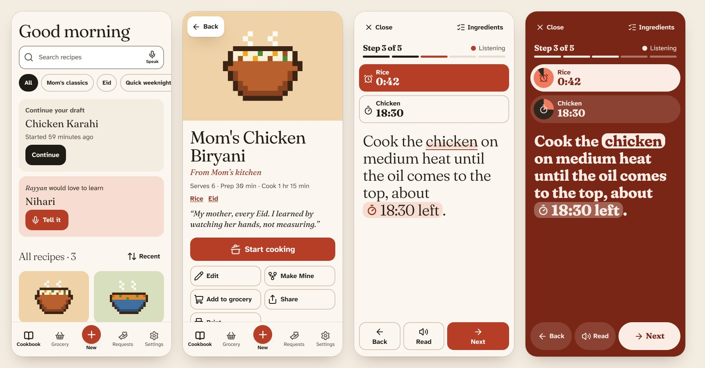
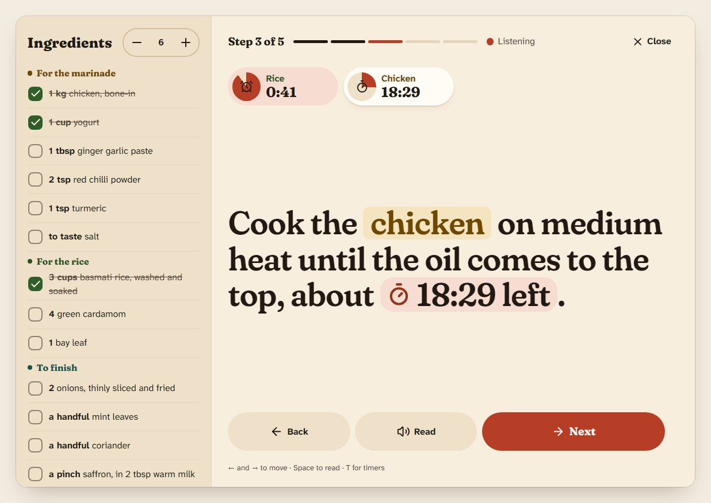
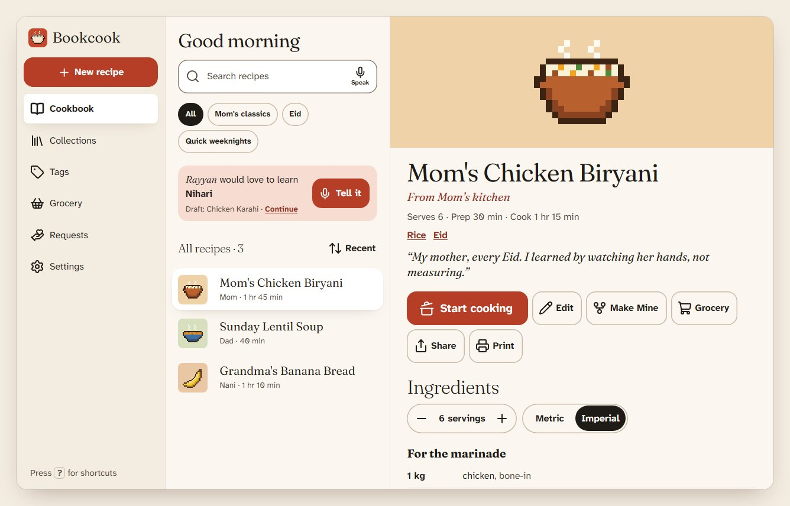

<div align="center">


# Bookcook

**A cookbook you can talk to.**

Save the recipes that only live in someone's head by saying them out loud,<br />
then cook from them hands-free.

[**Try it**](https://rvyyv-n.github.io/bookcook/) · [Roadmap](docs/roadmap.md) · [Design docs](docs/design/)

[](https://github.com/rvyyv-n/bookcook/actions/workflows/deploy.yml)
[](LICENSE)

</div>



Bookcook is for the family cook who wears reading glasses and has busy hands: very large text, big targets, and voice for everything. Tell it a recipe the way you'd tell a friend, and it turns what you said into ingredients, steps and timers, keeping the story behind the dish in the teller's own voice.

**[Open the app](https://rvyyv-n.github.io/bookcook/)** and tap _Try an example_ for three sample recipes. Install it from the browser menu to use it as an app, offline too. There's nothing to sign up for.

## Contents

- [Features](#features)
- [Privacy](#privacy)
- [Browser support](#browser-support)
- [How it's built](#how-its-built)
- [Development](#development)
- [Deployment](#deployment)
- [License](#license)

## Features

### Getting recipes in

- **Tell it.** A gentle interview, one question at a time: the name, whose recipe it is, how many it feeds, the ingredients, the steps, tips and the story behind it. Ingredients appear as you say them and durations become timers. Hands-free if you like.
- **Just talk.** Talk while you cook; Bookcook sorts it into ingredients and steps for you to check, and keeps every word as "In her words".
- **Type it, paste it or bring a link.** Type the way you'd say it (`2 cups basmati rice, washed`) with a live preview, paste messy text from WhatsApp or notes and have it tidied up, or import a recipe website's page.
- **Check before saving.** Whichever way it came in, you check it on one screen, with anything the parser was unsure of marked. Drafts save as you go, and every text field has a Speak button.

### Cooking

- **Cook mode.** One step at a time, in type you can read from across the kitchen. Steps are read aloud, voice commands (next, back, repeat, timer, stop) move you along without touching the screen, and the screen stays awake.
- **Timers.** Tap a duration in a step to start one. Several can run at once; a finished one chimes and speaks until you stop it, and they survive a reload.
- **Ingredients that follow you.** Scale servings and switch metric or imperial, and every amount updates, including the one that pops up when you tap an ingredient in a step.
- **I made it.** Rate it, note what to change next time, and add a photo to the cook log.

### Keeping and sharing

- **A cookbook to browse.** Search, collections, tags, sorting, and "Make Mine" copies of family recipes.
- **Grocery list.** Add a recipe's ingredients at the current scale; duplicates merge and items are grouped by aisle.
- **Requests.** Ask someone for the recipe you wish you could make like they do. They get a link, tell it, and send it back.
- **Share and back up.** Share a recipe as a link that adds it to someone else's cookbook. Back up everything, photos and voice notes included, to a `.bookcook` file, and restore it on any device.
- **Print the family cookbook.** A cover, contents, one recipe per page and the stories behind them, on Letter or A4.
- **Five looks.** Five skins, light and dark, two accents and three text sizes, up to Huge.



## Privacy

Bookcook is local-first. Recipes, photos and voice notes live on your device in IndexedDB. There's no account, no server holding your data and no analytics.

- **Share and request links** carry the recipe in the part of the URL after `#`, which browsers never send to a server. Recipe links hold the text only; photos and voice notes stay on your device.
- **Speech** uses your browser's own recognition and voices. In Chrome and Edge, recognition is done by the browser maker's speech service.
- **From a link** fetches the recipe page through a small function that stores nothing.
- **Backups** are files you keep wherever you like. The browser is also asked to keep Bookcook's storage, as these recipes can't be replaced.

## Browser support

| Browser                         | Works                        | Voice input                 |
| ------------------------------- | ---------------------------- | --------------------------- |
| Chrome, Edge (desktop, Android) | Yes, and installs as an app  | Yes                         |
| Safari (macOS, iOS)             | Yes, and adds to Home Screen | Partly                      |
| Firefox                         | Yes                          | No; typing and pasting work |

Reading aloud works everywhere. Where voice input isn't available, Tell it and Just talk say so and offer to type it instead.

## How it's built

React 19, TypeScript (strict), Vite, Tailwind CSS v4, React Aria Components and Dexie (IndexedDB), installable as a PWA. There's no AI and no paid service: a rule-based parser turns spoken and typed recipes into structured ones. It scores 100% on its tuned fixture corpus (`npm run parse:score`); the held-out set scored 72% before any tuning.

```
src/
  app/          routes, app shell, providers, speech wiring, keyboard shortcuts
  features/     one folder per area of the app:
    library/      cookbook, collections, tags, search
    recipe/       recipe detail and sharing
    cook/         cook mode and timers
    capture/      New recipe, Tell it, Just talk, Paste it, From a link
    editor/       Type it, edit, Check your recipe
    grocery/  requests/  settings/  print/
  ui/           shared components, built on React Aria
  design/       design tokens, theme, skins and icons (from the design handoff)
  db/           Dexie schema and repositories: the only database access
  lib/
    parse/        the rule-based recipe parser, with its fixture corpus
    speech/       listening and speaking behind one interface
    platform/     photos, voice recording, wake lock, storage, the timer chime
    shareLink.ts  recipe and request links
  i18n/         every UI string and voice phrase
  styles/       Tailwind entry and print styles
functions/      the From a link import function (a Cloudflare Pages Function)
public/         favicon and app icons
docs/           plan, roadmap, design brief; design/ holds the design handoff's docs
scripts/        parser scoring, app icons, screenshot helper
```

Tests sit next to the code they cover (`*.test.ts`).



### Design

The visual design comes from a design handoff. Its docs (screens, components, themes and the acceptance checklist) are in [`docs/design/`](docs/design/), with the decisions taken on it in [`DECISIONS.md`](docs/design/DECISIONS.md). Design values live only in `src/design/`; [`src/design/README.md`](src/design/README.md) explains how they're wired.

## Development

Needs Node 24 (see [`.nvmrc`](.nvmrc)).

```sh
npm install
npm run dev
```

Then open http://localhost:5173. The microphone works on `localhost` in Chrome and Edge, and the dev server also runs the From a link function at `/api/import`.

| Command               | What it does                                                           |
| --------------------- | ---------------------------------------------------------------------- |
| `npm run dev`         | Start the dev server                                                   |
| `npm run build`       | Typecheck and build to `dist/`                                         |
| `npm run preview`     | Serve the production build                                             |
| `npm test`            | Run the Vitest suite                                                   |
| `npm run typecheck`   | TypeScript only                                                        |
| `npm run lint`        | ESLint                                                                 |
| `npm run format`      | Prettier                                                               |
| `npm run parse:score` | Parser accuracy on the fixture corpus (`--verbose` lists failures)     |
| `npm run icons`       | Redraw the favicon and app icons from the logo (`src/ui/logoMarks.ts`) |

Before a commit, all of these should pass; CI runs the same checks:

```sh
npm test && npm run typecheck && npm run lint && npx prettier --check . && npm run build
```

### Screenshots

`node scripts/shot.mjs '<plan json>'` takes Playwright screenshots of the running dev server; the comment at the top of the file lists the options (viewport, theme, text size, settings, clicks, typing, file picks). `"fakeSpeech": true` swaps in a scripted recogniser, so voice screens can be driven with `__say('two onions')`. Set `CHROMIUM=/path/to/chrome` when Playwright's own browser isn't installed.

### Troubleshooting

On Windows, if `npm ci` fails with `EPERM ... lightningcss`, a running dev server still has the file open: stop it (Ctrl+C) and try again.

## Deployment

[`.github/workflows/deploy.yml`](.github/workflows/deploy.yml) runs the checks on every push and pull request. Pushes to `main` are then built with the `/bookcook/` base path and published to GitHub Pages. The service worker precaches the app so it works offline once installed. Dependabot opens one grouped update pull request a month for npm packages and one for GitHub Actions.

From a link needs its function (`functions/api/import.ts`) deployed beside the app, which GitHub Pages can't do: there, every link ends in "We couldn't read that page", and Paste it still works. On Cloudflare Pages the `functions/` folder is picked up as is. To use a function hosted elsewhere, build with `VITE_IMPORT_URL` set to its address.

Still to come: an Android app, onboarding and a final polish, and the move to Cloudflare Pages. See the [roadmap](docs/roadmap.md).

## License

[MIT](LICENSE) © rvyyv-n
